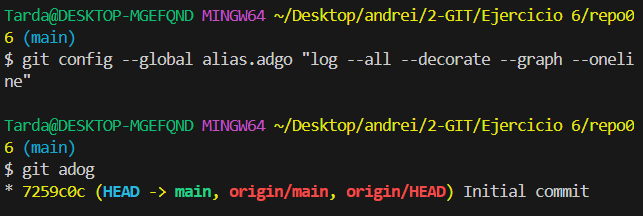
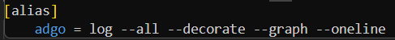

# Ejercicio 6

## Comandos:
Para hacer un alias al comando, se puede hacer de la siguente manera:
```bash
git config --global alias.adgo "log --all --decorate --graph --oneline"
```



## Fichero .gitconfig
